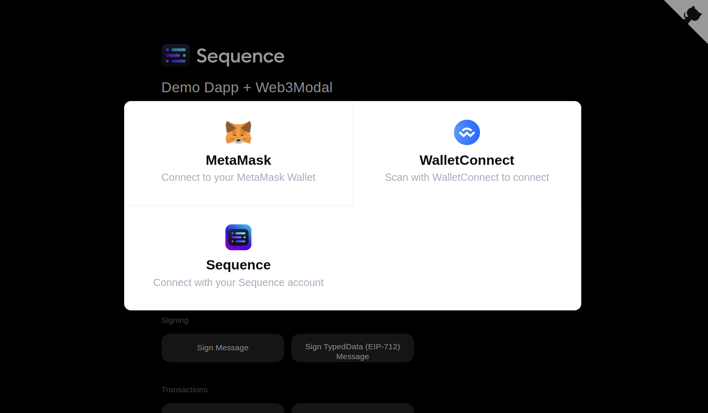
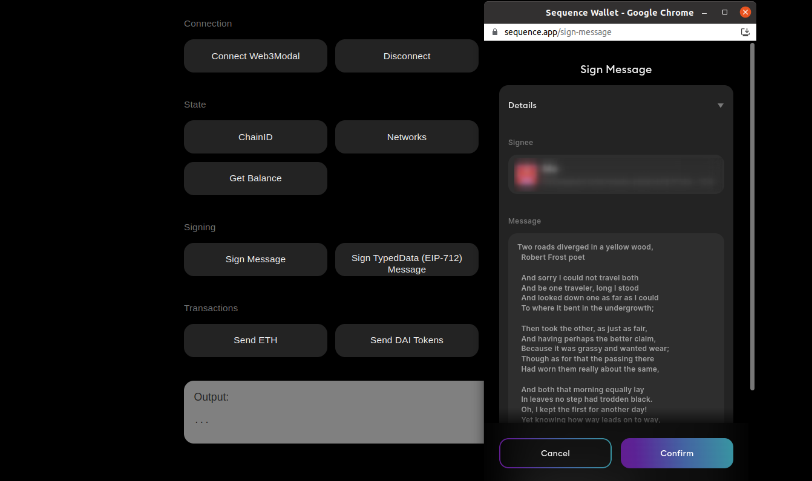

Demo Dapp + Web3Modal
=====================

Dapp example on how to use Sequence Wallet with [Web3Modal](https://github.com/Web3Modal/web3modal). Demonstrates how to connect a wallet, sign messages and send transactions.

Try this dapp at: [https://0xsequence.github.io/demo-dapp-web3modal](https://0xsequence.github.io/demo-dapp-web3modal)

For complete documentation on Sequence, please see: [https://docs.sequence.build](https://docs.sequence.build)

## Usage

1. yarn
2. yarn dev
3. Open browser to http://localhost:4000 to access the demo dapp
4. Open browser inspector to see responses from your wallet

## Development

See https://github.com/0xsequence/demo-dapp-web3modal/blob/master/src/App.tsx for the source
usage for a variety of functions. be sure t open your browser's dev inspector to see output.
Think of these functions as a "cookbook" for how you can perform these functions in your dapps.

Also note, sequence.js is built on top of ethers.js, and is API-compatible. Finally, this example
is compatible with Ethereum EIP1193 and standard JSON-RPC Web3Provider, so any dapp can plug in
which is compatible with 1193 providers.

## Screenshots

**Connect Wallet with Web3Modal with Sequence + WalletConnect options:**

**Execute common wallet functions:**

## LICENSE

Apache 2.0 or MIT (your choice)
